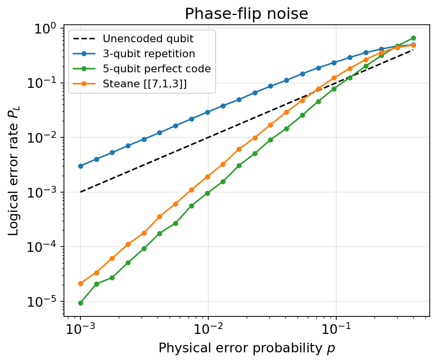
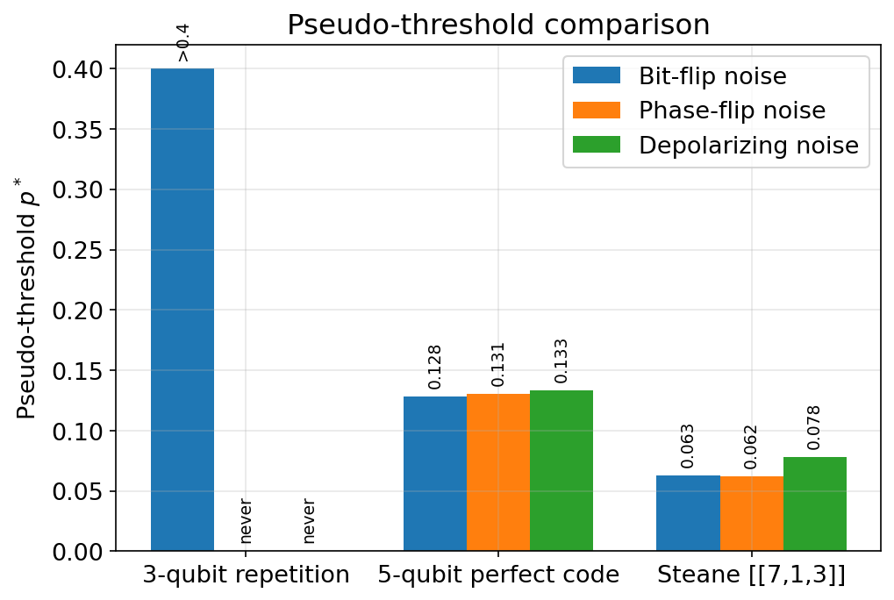
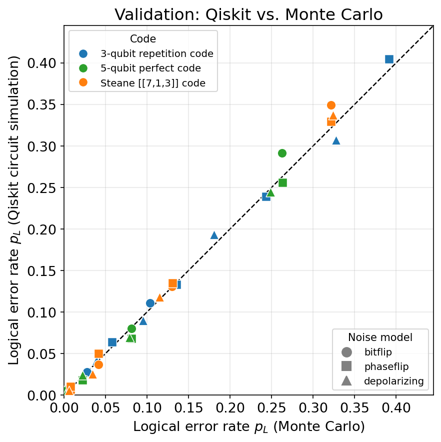

# Performance Comparison of Quantum Error-Correcting Codes

A performance comparison simulation comparing three quantum error-correcting codes, the 3-qubit
repetition code, the 5-qubit perfect code, and the Steane [[7,1,3]] code, under
bit-flip, phase-flip, and depolarizing noise. Built for the *Classical and Quantum
Error Correction* course at Politecnico di Milano.

## Overview

Each code is implemented and evaluated in two independent ways:

- **Monte Carlo simulation**, using the binary stabilizer formalism
   (errors, stabilizers, and corrections are represented as binary
   vectors over GF(2), and syndromes are derived from Pauli commutation relations).
   This produces the main performance comparison plots:
   logical error rate as a function of physical error
   probability, across 220 simulated configurations.
- **A full circuit-level simulation in Qiskit**, with real ancilla
   qubits, controlled-Pauli syndrome-extraction circuits, and
   classically-conditioned correction gates. Used to independently validate
   the Monte Carlo method.

The two methods are cross-validated against each other and agree to within
statistical noise, which is as expected: every operation involved (encoding,
syndrome extraction, correction) is a Clifford operation acting on Pauli
noise, so by the Gottesman–Knill theorem the Monte Carlo method is exact, not an
approximation.

## Main results

- The repetition code performs best under bit-flip noise (as expected) but
  performs worse than an unencoded qubit under phase-flip and depolarizing
  noise. Its stabilizers are Z-type only, so it has no protection against
  phase errors at all.
- The 5-qubit and Steane codes (both distance-3) perform almost identically
  across all three noise models, despite using 5 vs. 7 physical qubits.
- The 5-qubit code reaches a higher pseudo-threshold than Steane, at the
  cost of non-CSS decoder, while Steane's CSS structure gives it a simpler decoder
  in exchange for more physical qubit overhead.

<p align="center">
  
  
</p>

<p align="center">
  
</p>

See `figures/` for the full set of result plots.

## Repository structure

```
src/                    all source code (see below)
results/                CSV outputs from the simulation sweeps
figures/                result plots and stabilizer and circuit diagrams
presentation/           slides (PDF)
```

## Installation

```bash
pip install -r requirements.txt
```

## Usage

Reproduce the full set of results:

```bash
cd src

python3 codes.py               		# checks the code definitions
python3 run_experiments.py     		# runs the main Monte Carlo sweep
python3 make_plots.py          		# generates the result figures
python3 make_tableaus.py       		# generates the stabilizer diagrams
python3 qiskit_version.py      		# runs the Qiskit simulation
python3 make_qiskit_validation_plot.py 	# generates the Qiskit vs. Monte Carlo comparison plot
```

## Method summary

Monte Carlo simulation: Physical errors and stabilizer generators are represented as pairs of binary
vectors `(x, z)`. Commutation relations are used to compute syndromes,
decode via precomputed lookup tables (majority-vote for the repetition code,
classical Hamming-code decoding for Steane, direct stabilizer enumeration for
the 5-qubit code), and classify logical failure or success through residual error.

Qiskit simulation: Each trial builds and executes a real quantum circuit.
The logical codeword is prepared via Qiskit's StabilizerState,
which is given the code's stabilizer generators directly.
A physical error is injected as explicit single-qubit Pauli gates.
Each stabilizer generator is then measured with its own ancilla 
qubit, using the standard phase-kickback circuit: a Hadamard, one 
controlled-Pauli gate per qubit the generator acts on (all sharing that same 
ancilla as control), a second Hadamard, and a measurement, The measured syndrome bits are 
decoded with the same lookup tables used by the Monte Carlo method, and the 
resulting correction is applied via classically-conditioned quantum gates.

Decoding strategy per code:

| Code | Decoder | Lookup table construction |
|---|---|---|
| Repetition (3-qubit) | Majority vote | Direct lookup table |
| 5-qubit perfect code | Stabilizer-based enumeration | Non-CSS, brute-force enumeration of all weight-1 Pauli errors |
| Steane [[7,1,3]] | Classical Hamming (7,4) decoding | CSS, syndrome = qubit index |

## References

- Laflamme, R., Miquel, C., Paz, J.P., Zurek, W.H. (1996). *Perfect Quantum
  Error Correcting Code*. Phys. Rev. Lett. 77, 198.
- Steane, A.M. (1996). *Error Correcting Codes in Quantum Theory*. Phys. Rev.
  Lett. 77, 793.
- Gottesman, D. (1997). *Stabilizer Codes and Quantum Error Correction*. PhD
  thesis, Caltech.
- Nielsen, M.A. & Chuang, I.L. (2000). *Quantum Computation and Quantum
  Information*. Cambridge University Press.

## License

MIT
